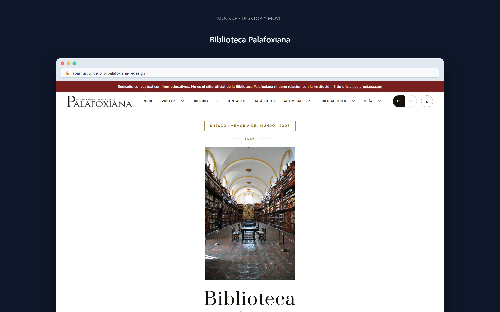
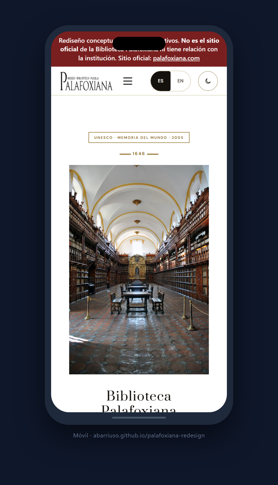
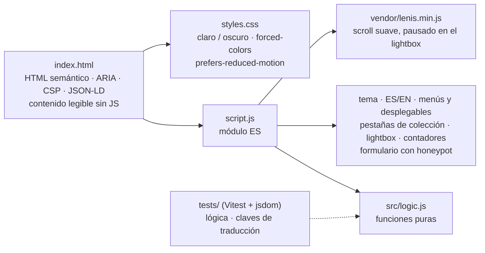
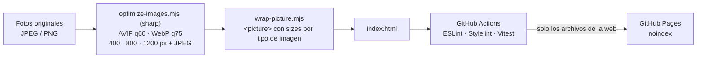

# Biblioteca Palafoxiana

*Rediseño conceptual de la primera biblioteca pública de América*

[](https://github.com/abarriuso/palafoxiana-redesign/actions/workflows/deploy.yml)
[](LICENSE)

[English](README.md) · **Español**

[Demo en vivo](https://abarriuso.github.io/palafoxiana-redesign/) · [Sitio oficial](https://www.palafoxiana.com) · [Licencia MIT](LICENSE)

---

> **Proyecto educativo de portafolio.** Sin afiliación, patrocinio ni autorización de la Biblioteca Palafoxiana, del Gobierno del Estado de Puebla, ni de UNESCO.

---

## Ver el rediseño

**[→ Demo en vivo](https://abarriuso.github.io/palafoxiana-redesign/)** · [Sitio original](https://www.palafoxiana.com/)

> La demo se publica con `noindex`: es un rediseño conceptual y no debe competir en
> buscadores con el sitio oficial de la institución.

## Capturas

| Escritorio | Móvil |
|:---:|:---:|
|  |  |

---

## Stack

```
HTML5 semántico + ARIA    ·    CSS3 vanilla (0 dependencias)    ·    JavaScript vanilla (0 bundlers)
```

| Componente | Tecnología | Detalle |
|---|---|---|
| **Fuentes** | Lora · DM Sans · Prata | Self-hosted woff2 — 0 requests a Google Fonts |
| **Smooth scroll** | [Lenis 1.1.18](https://github.com/darkroomengineering/lenis) | Servido localmente desde `vendor/` |
| **Imágenes** | Sharp | AVIF y WebP en tres anchos, con JPEG de respaldo |
| **Herramientas** | pnpm (solo desarrollo) | Tests, lint y optimización de imágenes |

---

## Funcionalidades

<details>
<summary><strong>UI / UX</strong></summary>

- Tema claro / oscuro — persistencia en `localStorage`, respeta `prefers-color-scheme`
- i18n ES / EN — traducciones completas con switch en header
- Galería lightbox — 20 fotos, navegación por teclado, swipe táctil y flechas
- Scroll animado — fade-in con IntersectionObserver
- Contadores animados — ease-out-cubic en las estadísticas
- Menú responsive — hamburger en móvil, dropdowns en desktop
- Formulario — validación HTML5, honeypot anti-spam, feedback visual

</details>

<details>
<summary><strong>Performance</strong></summary>

| Métrica | Antes | Después |
|---|---|---|
| Imágenes | JPG sin optimizar | **AVIF/WebP responsive** (~−74% peso servido) |
| CLS | Sin dimensiones | **0** (width/height en todas) |
| LCP | Sin preload | **Hero precargada** + fetchpriority |
| Fonts | Google Fonts CDN | **Self-hosted** woff2 |
| Lenis rAF | Loop infinito | **Se detiene al abrir el lightbox** |

</details>

<details>
<summary><strong>Accesibilidad</strong></summary>

- Skip link al contenido principal
- Roles ARIA (`banner`, `main`, `contentinfo`, `dialog`, `tablist`/`tab`/`tabpanel`)
- Navegación por teclado completa: dropdowns con `aria-controls` + cierre con Escape, tabs con flechas, lightbox con focus trap y `inert` de fondo
- `role="switch"` + `aria-checked` en el toggle de tema
- `aria-invalid` en errores de formulario
- Contraste AA, `:focus-visible`, `forced-colors` y `prefers-reduced-motion`
- Contenido visible sin JS (progressive enhancement)
- Alt text descriptivo en todas las imágenes

</details>

<details>
<summary><strong>Seguridad</strong></summary>

- Content Security Policy (meta-tag, compatible con GitHub Pages)
- Fuentes e imágenes self-hosted (0 requests a terceros en runtime)
- `rel="noopener noreferrer"` en todos los enlaces externos
- Honeypot anti-spam en el formulario (demo, sin backend)

</details>

---

## Cómo está hecho

Una página HTML, una hoja de estilos y un módulo ES; la lógica que se puede
probar sin navegador vive en `src/logic.js`.



Las imágenes se preparan una vez con Node y el resultado se versiona; el deploy
solo copia los archivos de la web tras pasar lint y tests:



---

## Estructura

```
├── assets/            Imágenes optimizadas (AVIF y WebP en tres anchos, JPEG de respaldo)
├── fonts/             9 fuentes woff2 self-hosted
├── vendor/
│   └── lenis.min.js   Smooth scroll library
├── index.html         HTML semántico + ARIA + CSP + JSON-LD
├── styles.css         ~2,400 líneas CSS vanilla
├── script.js          Módulo ES (lógica en src/logic.js)
├── src/
│   └── logic.js        Lógica pura testeable (Vitest)
├── tests/
│   ├── logic.test.js   Tests unitarios de la lógica
│   └── i18n.test.js    Cobertura de claves de traducción
├── favicon.ico        Generado desde el logo
├── robots.txt         Reglas para crawlers (noindex)
├── LICENSE            MIT
└── NOTICE             Atribución de imágenes y contenidos
```

---

## Ejecutar localmente

```bash
python3 -m http.server 8080
# → http://localhost:8080
```

---

## Licencia

| Archivo | Licencia |
|---|---|
| Código (HTML, CSS, JS) y documentación | [MIT](LICENSE) |
| Fotografías, reproducciones históricas, textos institucionales, nombre y logotipo | Fuera de la licencia MIT: © de sus titulares, usados solo con fines educativos y de portafolio — ver [NOTICE](NOTICE) |

---

Para información oficial, eventos, catálogo o solicitudes formales:
[palafoxiana.com](https://www.palafoxiana.com) — 5 Oriente 5, 2º piso, Centro, Puebla, México.
