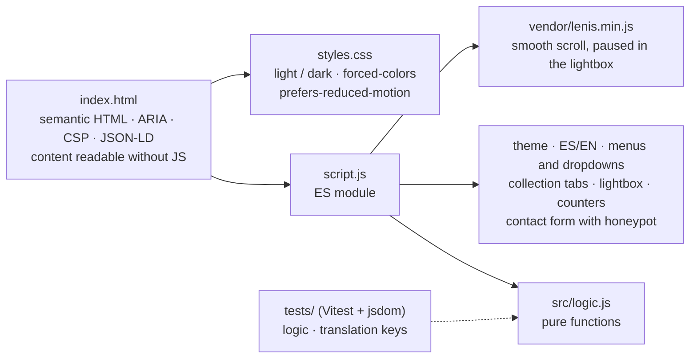
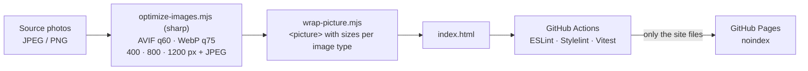

# Biblioteca Palafoxiana

*A concept redesign for the first public library in the Americas*

[](https://github.com/abarriuso/palafoxiana-redesign/actions/workflows/deploy.yml)
[](LICENSE)

**English** · [Español](README.es.md)

[Live demo](https://abarriuso.github.io/palafoxiana-redesign/) · [Official site](https://www.palafoxiana.com) · [MIT licence](LICENSE)

---

> **Educational portfolio project.** Not affiliated with, sponsored or authorised by the Biblioteca Palafoxiana, the Government of the State of Puebla or UNESCO.

---

## See the redesign

**[→ Live demo](https://abarriuso.github.io/palafoxiana-redesign/)** · [Original site](https://www.palafoxiana.com/)

> The demo is published with `noindex`: it is a concept redesign and should not
> compete in search engines with the institution's official site.

## Screenshots

| Desktop | Mobile |
|:---:|:---:|
|  |  |

---

## Stack

```
Semantic HTML5 + ARIA    ·    Vanilla CSS3 (0 dependencies)    ·    Vanilla JavaScript (0 bundlers)
```

| Component | Technology | Detail |
|---|---|---|
| **Fonts** | Lora · DM Sans · Prata | Self-hosted woff2 — no requests to Google Fonts |
| **Smooth scroll** | [Lenis 1.1.18](https://github.com/darkroomengineering/lenis) | Served locally from `vendor/` |
| **Images** | Sharp | AVIF and WebP at three widths, with a JPEG fallback |
| **Tooling** | pnpm (dev only) | Tests, lint and image optimisation |

---

## Features

<details>
<summary><strong>UI / UX</strong></summary>

- Light / dark theme — saved in `localStorage`, follows `prefers-color-scheme`
- ES / EN i18n — full translations with a switch in the header
- Lightbox gallery — 20 photos, keyboard navigation, touch swipe and arrows
- Animated scroll — fade-in with IntersectionObserver
- Animated counters — ease-out-cubic on the statistics
- Responsive menu — hamburger on mobile, dropdowns on desktop
- Form — HTML5 validation, anti-spam honeypot, visual feedback

</details>

<details>
<summary><strong>Performance</strong></summary>

| Metric | Before | After |
|---|---|---|
| Images | Unoptimised JPG | **Responsive AVIF/WebP** (~−74% bytes served) |
| CLS | No dimensions | **0** (width/height on every image) |
| LCP | No preload | **Hero preloaded** + fetchpriority |
| Fonts | Google Fonts CDN | **Self-hosted** woff2 |
| Lenis rAF | Endless loop | **Stops while the lightbox is open** |

</details>

<details>
<summary><strong>Accessibility</strong></summary>

- Skip link to the main content
- ARIA roles (`banner`, `main`, `contentinfo`, `dialog`, `tablist`/`tab`/`tabpanel`)
- Full keyboard navigation: dropdowns with `aria-controls` and Escape to close, tabs with arrow keys, lightbox with a focus trap and `inert` background
- `role="switch"` + `aria-checked` on the theme toggle
- `aria-invalid` on form errors
- AA contrast, `:focus-visible`, `forced-colors` and `prefers-reduced-motion`
- Content visible without JS (progressive enhancement)
- Descriptive alt text on every image

</details>

<details>
<summary><strong>Security</strong></summary>

- Content Security Policy (meta tag, compatible with GitHub Pages)
- Self-hosted fonts and images (no third-party requests at runtime)
- `rel="noopener noreferrer"` on every external link
- Anti-spam honeypot on the form (demo, no backend)

</details>

---

## How it is built

One HTML page, one stylesheet and one ES module; the logic that can be tested
without a browser lives in `src/logic.js`.



Images are prepared once with Node and the result is committed; the deploy only
copies the site files after lint and tests pass:



---

## Layout

```
├── assets/            Optimised images (AVIF and WebP at three widths, JPEG fallback)
├── fonts/             9 self-hosted woff2 fonts
├── vendor/
│   └── lenis.min.js   Smooth scroll library
├── index.html         Semantic HTML + ARIA + CSP + JSON-LD
├── styles.css         ~2,400 lines of vanilla CSS
├── script.js          ES module (logic in src/logic.js)
├── src/
│   └── logic.js       Pure, testable logic (Vitest)
├── tests/
│   ├── logic.test.js  Unit tests for the logic
│   └── i18n.test.js   Translation key coverage
├── favicon.ico        Generated from the logo
├── robots.txt         Crawler rules (noindex)
├── LICENSE            MIT
└── NOTICE             Image and content attribution
```

---

## Running it locally

```bash
python3 -m http.server 8080
# → http://localhost:8080
```

---

## Licence

| Files | Licence |
|---|---|
| Code (HTML, CSS, JS) and documentation | [MIT](LICENSE) |
| Photographs, historical reproductions, institutional texts, name and logo | Not covered by the MIT licence: © their owners, used for educational/portfolio purposes only — see [NOTICE](NOTICE) |

---

For official information, events, the catalogue or formal requests:
[palafoxiana.com](https://www.palafoxiana.com) — 5 Oriente 5, 2nd floor, Centro, Puebla, Mexico.
